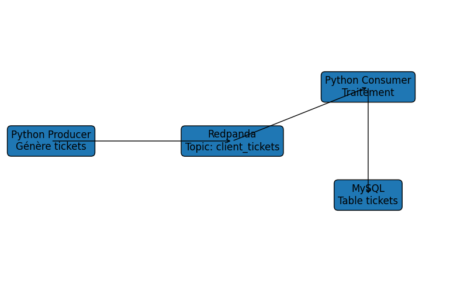
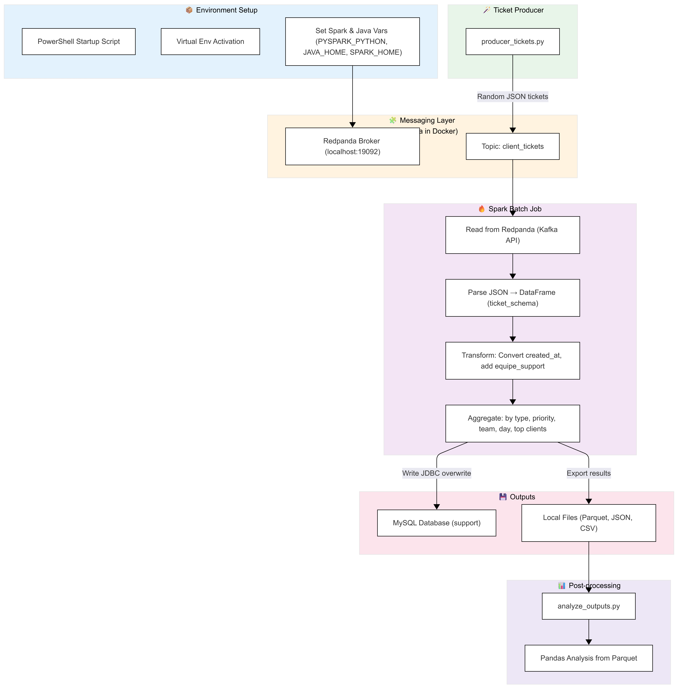

# InduTech — Pipeline tickets support

Pipeline de données de tickets support industriel : ingestion Kafka (Redpanda), traitement batch PySpark, enrichissement métier, export fichiers (Parquet/JSON/CSV). Entièrement conteneurisé via Docker.

**Vidéo de démonstration** : [Loom — pipeline complet](https://www.loom.com/share/96ff3f34e3ef46ba83a6c74909f0c6f3)  
**Vidéo conteneurisation** : [Loom — Docker](https://www.loom.com/share/b14fbce7f20c42ca9fc86e203b0a01a6)

---

## Architecture





```
[producer_tickets.py]
        │  JSON → topic "client_tickets"
        ▼
[Redpanda / Kafka]
        │  batch read (earliest → latest)
        ▼
[poc_tickets_batch_json.py — PySpark]
        │  parse + enrichissement + agrégations
        ├──▶ output/tickets_enriched_parquet/
        ├──▶ output/tickets_by_type_json/
        └──▶ output/analyses/
                ├── tickets_by_priority_json/
                ├── tickets_by_team_json/
                ├── tickets_by_day_csv/
                └── top_clients_csv/

[analyze_outputs.py — pandas]          (optionnel, post-pipeline)
        └──▶ output/analyses/post_python/
```

**Logique d'enrichissement** : chaque ticket reçoit une colonne `equipe_support` dérivée de `type_demande` :

| `type_demande` | `equipe_support` |
|----------------|------------------|
| `technique` | Equipe Technique |
| `facturation` | Equipe Facturation |
| `compte` | Equipe Compte |
| autres | Equipe Generale |

---

## Arborescence du dépôt

```
InduTechData/
├── data/                              # Diagrammes et docs de référence
│   ├── architecture_redpanda.png      # Schéma global de l'architecture
│   ├── architecture.png               # Vue alternative
│   ├── mermaid-ai-diagram-*.png       # Diagramme pipeline local
│   ├── mermaid-diagram-complet.png    # Diagramme complet
│   ├── mermaid-diagram-leger.png      # Diagramme simplifié
│   ├── archihybride.doc               # Architecture hybride (Word)
│   └── InduTechData.pptx              # Présentation du projet
│
├── docker/                            # Tous les fichiers Docker
│   ├── redpanda/
│   │   └── Dockerfile                 # Image Redpanda (v25.3.7)
│   ├── Dockerfile.producer            # Image du producteur de tickets
│   └── Dockerfile.pyspark             # Image du job PySpark batch
│
├── scripts/                           # Scripts Spark complémentaires (dev/debug)
│   ├── spark_read_tickets.py          # Streaming simple → console
│   ├── spark_stream_tickets.py        # Streaming → MySQL (foreachBatch)
│   └── test_mysql_spark.py            # Test d'écriture JDBC MySQL
│
├── tests/                             # Suite de tests
│   ├── test_conn.py                   # Test connexion Redpanda/Kafka
│   ├── test_pyspark.py                # Smoke test PySpark (DataFrame simple)
│   ├── test_containerization.py       # Test d'intégration Docker end-to-end
│   ├── producer.py                    # Producteur générique (topic "events")
│   ├── consumer.py                    # Consommateur générique (topic "events")
│   ├── producer_tickets.py            # Producteur tickets (variante test)
│   └── consumer_tickets.py            # Consommateur tickets (variante test)
│
├── producer_tickets.py                # ★ Producteur principal Kafka
├── poc_tickets_batch_json.py          # ★ Job PySpark batch (script principal)
├── poc_tickets_batch.py               # Variante batch → MySQL (désactivé)
├── consumer_mysql.py                  # Variante consumer direct → MySQL (désactivé)
├── stream_tickets_pyspark.py          # Streaming PySpark → console (dev)
├── analyze_outputs.py                 # Post-analyse pandas sur le Parquet généré
│
├── docker-compose.yml                 # Orchestration des 3 conteneurs
├── requirements.txt                   # Dépendances Python
├── start_spark.ps1                    # Bootstrap Spark/Java/Hadoop (Windows local)
└── .gitignore
```

> **Scripts principaux** : `producer_tickets.py` et `poc_tickets_batch_json.py`.  
> Tous les autres scripts sont des variantes dev, archives ou tests unitaires.

---

## Cloner et démarrer

### 1. Cloner le dépôt

```bash
git clone https://github.com/PascalDuval/InduTechData.git
cd InduTechData
```

### 2. Prérequis

| Composant | Version minimale | Usage |
|-----------|-----------------|-------|
| Docker Desktop | 4.x | Version Docker (recommandée) |
| Python | 3.10+ | Version locale uniquement |
| Java JDK | 11+ | Version locale uniquement |
| Apache Spark | 3.5.x | Version locale uniquement |

### 3. Installation Python (version locale uniquement)

```bash
# Créer l'environnement virtuel
python -m venv venv

# Activer — Windows
.\venv\Scripts\Activate.ps1

# Activer — Linux/Mac
source venv/bin/activate

# Installer les dépendances
pip install -r requirements.txt
```

**`requirements.txt`** :
```
pyspark==3.5.1
kafka-python
mysql-connector-python
pandas
pyarrow
```

---

## Lancer le pipeline — Version Docker (recommandée)

Docker Desktop doit être démarré (icône verte dans la barre des tâches).

### Démarrage complet

```powershell
# 1. Nettoyer les sorties précédentes
Remove-Item -Recurse -Force .\output\* -ErrorAction SilentlyContinue

# 2. Arrêter les conteneurs existants
docker compose down

# 3. Construire et démarrer les 3 services
docker compose up --build -d

# 4. Attendre ~30 secondes que Redpanda soit prêt
# Vérifier l'état
docker compose ps
```

Résultat attendu — 3 conteneurs UP :

| Conteneur | Rôle |
|-----------|------|
| `redpanda` | Broker Kafka/Redpanda |
| `producer_tickets` | Génère et publie 1 ticket/seconde |
| `pyspark_batch` | Lit le topic, traite, exporte les fichiers |

```powershell
# 5. Vérifier le topic Kafka
docker compose exec -T redpanda rpk topic list
# Attendu : client_tickets

# 6. Surveiller les logs
docker compose logs --follow producer
docker compose logs --follow pyspark

# 7. Vérifier les fichiers produits dans le conteneur
docker compose exec pyspark ls -la /app/output/

# 8. Arrêter et nettoyer
docker compose down -v
```

### Ports exposés

| Service | Port hôte | Port interne |
|---------|-----------|-------------|
| Kafka/Redpanda | 19093 | 9092 |
| Schema Registry | 18085 | 8081 |
| PandaProxy | 18086 | 8082 |
| Admin API | 9648 | 9644 |

---

## Lancer le pipeline — Version locale (sans Docker)

Cette version nécessite Java, Spark, et un environnement Python activé.

```powershell
# 0. Bootstrap Spark/Java/Hadoop (Windows uniquement)
.\start_spark.ps1

# 1. Activer le venv
.\venv\Scripts\Activate.ps1

# 2. Démarrer Redpanda seul via Docker
docker compose up redpanda -d

# 3. Vérifier la connexion
python tests/test_conn.py
# Attendu : "connexion Redpanda OK"

# 4. Lancer le producteur (terminal 1)
python producer_tickets.py

# 5. Lancer le batch PySpark (terminal 2)
python poc_tickets_batch_json.py

# 6. Vérifier les sorties
Get-ChildItem .\output\ -Recurse
```

---

## Description détaillée des scripts

### Scripts principaux

#### `producer_tickets.py`
Génère aléatoirement des tickets clients et les publie en JSON dans Redpanda sur le topic `client_tickets`, à raison d'1 ticket/seconde.

- Connexion : `KafkaProducer` sur `localhost:19093` (local) ou `redpanda:9092` (Docker)
- Champs générés : `ticket_id`, `client_id`, `created_at`, `demande`, `type_demande`, `priorite`
- Fonctionne en boucle infinie jusqu'à interruption (Ctrl+C)

#### `poc_tickets_batch_json.py` — script principal

Job PySpark batch complet. Lance une session Spark locale (`local[*]`), lit le topic Kafka en snapshot (`earliest → latest`), parse les messages JSON, enrichit les données, calcule des agrégations, et exporte en fichiers.

**Étapes internes :**
1. Bootstrap automatique `PYSPARK_PYTHON`, `JAVA_HOME`, `SPARK_HOME`
2. Lecture batch Kafka → DataFrame brut
3. Parse JSON avec schéma explicite (`ticket_schema`)
4. Conversion `created_at` → timestamp réel
5. Ajout colonne `equipe_support` (logique de routage métier)
6. Calcul de 4 agrégations analytiques
7. Export en Parquet, JSON, CSV (fallback pandas si PySpark échoue sur Windows)

**Sorties générées :**

| Dossier | Format | Contenu |
|---------|--------|---------|
| `output/tickets_enriched_parquet/` | Parquet | Tickets enrichis complets |
| `output/tickets_by_type_json/` | JSON Lines | Agrégat par type de demande |
| `output/analyses/tickets_by_priority_json/` | JSON Lines | Agrégat par priorité |
| `output/analyses/tickets_by_team_json/` | JSON Lines | Agrégat par équipe support |
| `output/analyses/tickets_by_day_csv/` | CSV | Volume journalier |
| `output/analyses/top_clients_csv/` | CSV | Top 10 clients |

#### `analyze_outputs.py`
Post-traitement optionnel. Relit le Parquet généré par le batch avec pandas et recalcule les indicateurs clés. Utile pour tester les analyses sans relancer Spark.

```powershell
.\venv\Scripts\Activate.ps1
python analyze_outputs.py
# Sorties : output/analyses/post_python/
```

### Scripts variantes (désactivés par défaut)

| Script | Description |
|--------|-------------|
| `poc_tickets_batch.py` | Variante du batch PySpark qui écrit dans MySQL (nécessite MySQL actif) |
| `consumer_mysql.py` | Consommateur Kafka en streaming direct vers MySQL |
| `stream_tickets_pyspark.py` | Streaming PySpark → console (mode debug) |

### Scripts utilitaires `scripts/`

| Script | Description |
|--------|-------------|
| `scripts/spark_read_tickets.py` | Streaming simple : lit `client_tickets` et affiche en console (sans parsing JSON) |
| `scripts/spark_stream_tickets.py` | Streaming structuré avec parse JSON + enrichissement + écriture MySQL (`foreachBatch`) |
| `scripts/test_mysql_spark.py` | Vérifie qu'un DataFrame Spark peut s'écrire en MySQL via JDBC |

---

## Tests

### `tests/test_conn.py` — Test de connexion Kafka

Vérifie que Redpanda/Kafka est accessible sur `localhost:19093`.

```powershell
python tests/test_conn.py
# OK : "connexion Redpanda OK"
# KO : message d'erreur avec la cause
```

### `tests/test_pyspark.py` — Smoke test PySpark

Crée un DataFrame simple (3 lignes) et l'affiche. Valide que PySpark est correctement installé et fonctionnel.

```powershell
python tests/test_pyspark.py
# Attendu : tableau Alice/Bob/Cathy affiché sans erreur
```

### `tests/test_containerization.py` — Test d'intégration Docker

Lance la séquence Docker complète de façon automatisée :
1. `docker compose up --build -d`
2. Attend 15 secondes
3. Vérifie `docker compose ps`
4. Vérifie le topic Kafka via `rpk topic list`
5. Liste les fichiers produits dans le conteneur pyspark
6. `docker compose down -v`

```powershell
python tests/test_containerization.py
# Attendu : "Succès: conteneurisation testée."
```

> Prérequis : Docker Desktop démarré.

### `tests/producer.py` / `tests/consumer.py` — Tests Kafka génériques

Producteur et consommateur sur le topic générique `events` (port `19092`). Utilisés pour valider la connectivité Kafka de base, indépendamment du pipeline tickets.

```powershell
# Terminal 1 — consommateur en écoute
python tests/consumer.py

# Terminal 2 — producteur
python tests/producer.py
```

### `tests/producer_tickets.py` / `tests/consumer_tickets.py` — Tests tickets

Variantes de test du producteur et consommateur dédiés au topic `client_tickets`. Permettent de tester le format JSON des tickets sans lancer le pipeline complet.

---

## Modèle de données

### Ticket brut (JSON Kafka)

```json
{
  "ticket_id": 42,
  "client_id": 7381,
  "created_at": "2026-03-20T10:15:30.123456",
  "demande": "Problème de connexion",
  "type_demande": "technique",
  "priorite": "haute"
}
```

### Ticket enrichi (après PySpark)

Champs ajoutés :

| Champ | Type | Description |
|-------|------|-------------|
| `created_at_ts` | Timestamp | `created_at` converti en type datetime |
| `equipe_support` | String | Équipe assignée selon `type_demande` |

### Valeurs possibles

`type_demande` : `technique`, `facturation`, `compte`  
`priorite` : `basse`, `moyenne`, `haute`, `critique`

---

## Lire les fichiers de sortie

### Lire un Parquet

```python
import pandas as pd
df = pd.read_parquet("output/tickets_enriched_parquet/part-00000.parquet")
print(df.head())
print(df.dtypes)
```

### Convertir en CSV

```python
import pandas as pd
df = pd.read_parquet("output/tickets_enriched_parquet/part-00000.parquet")
df.to_csv("output/tickets_enriched.csv", index=False)
```

### Lire un JSON Lines

```python
import pandas as pd
df = pd.read_json("output/tickets_by_type_json/part-00000.json", lines=True)
print(df)
```

---

## Dépannage

| Symptôme | Cause probable | Solution |
|----------|---------------|---------|
| `pipe/dockerDesktopLinuxEngine` | Docker Desktop non démarré | Ouvrir Docker Desktop, attendre l'icône verte |
| Topic introuvable | Redpanda pas encore prêt | Attendre 30s après `docker compose up` |
| Exports vides / `part-00000.*` | Fallback pandas activé (normal Windows) | Les fichiers sont bien là, format identique |
| `java.lang.UnsatisfiedLinkError` | Hadoop natif manquant | Déjà géré dans le script (`hadoop.io.native.lib.available=false`) |
| Port 19093 déjà utilisé | Un autre service occupe le port | `netstat -an \| findstr 19093` puis stopper le service |
| `pyspark` conteneur exit 0 immédiatement | Comportement normal d'un job batch | Vérifier les fichiers dans `output/` |

---

## Stack technique

| Composant | Version |
|-----------|---------|
| PySpark | 3.5.1 |
| Redpanda | v25.3.7 |
| kafka-python | latest |
| pandas | latest |
| pyarrow | latest |
| Python | 3.11 (Docker) / 3.10+ (local) |
| Java | default-jdk (Docker) / JDK 11+ (local) |

---

## Licence

Projet pédagogique — OpenClassRooms Data Engineer.
